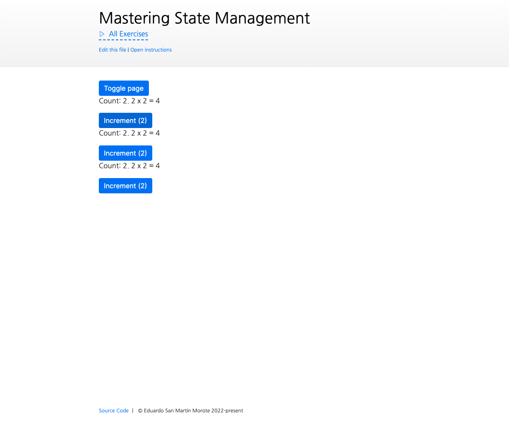

# Dependency Injection: Using `inject()` and `provide()` for our `defineStore()`

<picture>
  <source srcset="./.internal/screenshot-dark.png" media="(prefers-color-scheme: dark)">
  
</picture>

Let's refactor our store to use what we just saw and bring it a bit closer to compatibility with SSR. During this
exercise, we will refactor the `defineStore()` function from the previous exercise and rely on `effectScope()`,
`inject()` `provide()` to make it more robust.

## 📝 Your Notes

Write your notes or questions here.

## 🎯 Goals

- Keep the exact same `defineStore()` API as before
- Use `provide()` to provide one effectScope per application
- Use `inject()` to retrieve the effectScope when calling `defineStore()`
- Ensure the store map is also specific to the application instance

## 💪 Extra goals

Optional goals that are not required but can be done later or skipped.

- Create one effectScope per store, **nested within the application effectScope**
