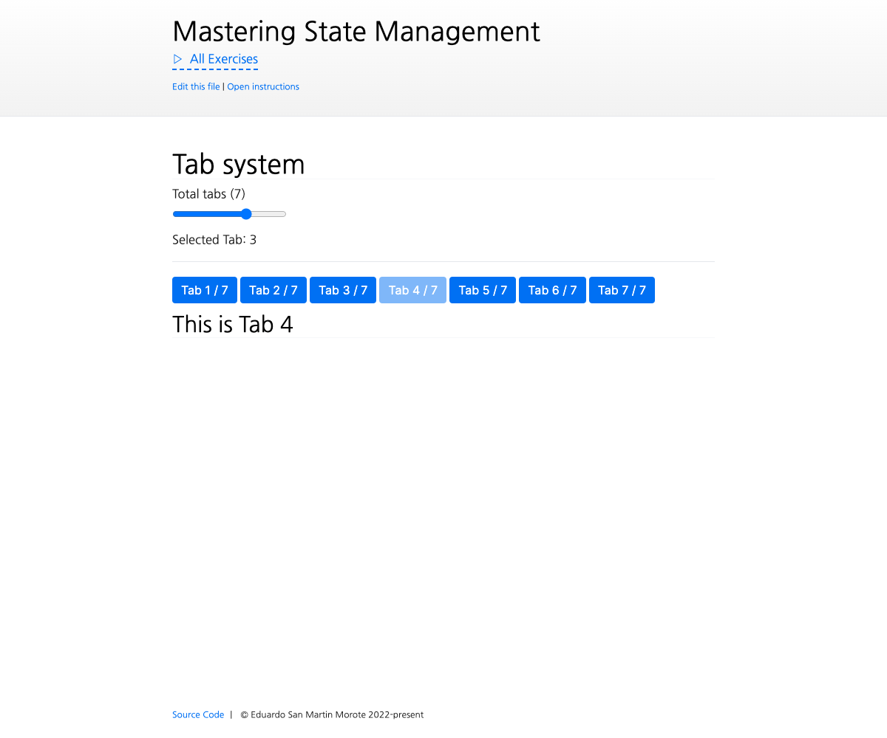

# Tab System with inject/provide

<picture>
  <source srcset="./.internal/screenshot-dark.png" media="(prefers-color-scheme: dark)">
  
</picture>

Some components are always meant to be used together, we call these coupled components. Very often they also need a
mechanism to communicate with each other to make sure everything is in sync and they render the correct information all
the time. One example of this is a Tab Manager / System: where two components, `<TabManager>` and `<TabPane>` are used
together to display one single tab at a time:

```vue
<TabManager v-model="currentTab">
  <TabPane title="Overview">
    Overview of the restaurant
  </TabPane>
  <TabPane title="Menu">
    Menu of the restaurant
  </TabPane>
</TabManager>
```

Semantically, they use _slots_ to be expressive. Internally, they rely on `inject`/`provide` to keep everything in sync.
Let's build them!

NOTE: this is a bonus exercise, it's meant **to be really hard** and push you to your limits. It goes beyond what has
been taught in the course so far. **It's completely okay to give up in the middle of it**. Feel free to completely skip
it as **it's not needed to fully understand Pinia**.

## 📝 Your Notes

Write your notes or questions here.

## 🎯 Goals

- Allow each `TabPane` to customize its `title` with a prop
  - It will be the only prop you will need to pass to `TabPane`
- Start by displaying all the `TabPane`s content ("This is Tab 1" will be displayed at the same time as "This is Tab 2",
- Find a way to store what `TabPane`s are currently _registered_ within `TabManager`
  - Each `TabPane` should _communicate_ to `TabManager` that it exists
  - Use the injection key inside `injectionKey.ts` for `provide`/`inject`
    - Replace the `TODO` type with the type of what you want to provide etc.). We will focus later on only displaying
      the currently selected tab
- `TabManager` should display one button per `TabPane`
- Each button should display the `title` prop corresponding to its associated `TabPane`
- Each `TabPane` should display its content, start by displaying all of them
- Find a way to only display the currently selected tab
  - `TabManager` should be the one holding the state of the currently selected tab. This information should be
    serializable (a number or string). It will be necessary for one of the extra goals
- Clicking on the buttons should switch between tabs
- Disable the currently selected tab's button
- Ensure changes to the `title` prop are reflected on the buttons. You can try this by changing the total of tabs

## 💪 Extra goals

_Extra goals might not have any tests and can be done later or skipped._

- Ensure the minimal information is passed from `TabManager` to `TabPane`
  - `TabPane` should not know about the other `TabPane`s
  - `TabPane` should not know about the currently selected tab
  - `TabPane` should **only know** if it is selected or not
- Allow `TabManager` to accept both a `v-model` to control the currently selected tab
- Allow `TabManager` to work without a `v-model`
- Connect the current tab to the URL using a query
  - Changing the tab should update the URL
  - Changing the URL should update the tab
  - It's better to use a composable for this than to write any new logic in `TabManager`
