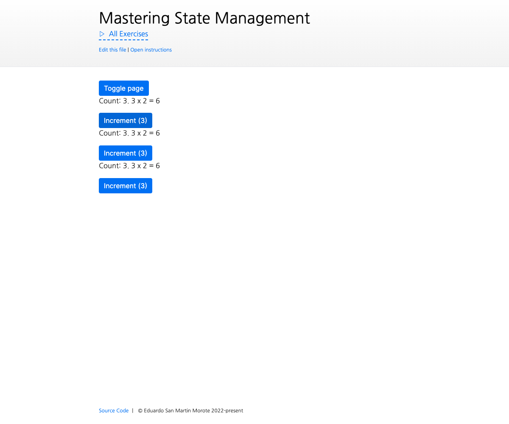

# Implementing our own `defineStore()` to understand `effectScope()`

<picture>
  <source srcset="./.internal/screenshot-dark.png" media="(prefers-color-scheme: dark)">
  
</picture>

Let's refactor our store to use `effectScope()` and bring it closer to compatibility with SSR. During this exercise, we
will create our own `defineStore()` function, similar to pinia's `defineStore()`.

## 🎯 Goals

- Refactor the current global variables within the `useStore()` function to use `effectScope()`
- Ensure only one `effectScope()` is created per store
- Ensure the `effectScope()` is **not disposed** when the component is destroyed
- Allow the `useStore()` to be called by different components at any time and share the state
- let's refactor this into a `defineStore()` function that accepts a function as its first and only argument:

```js
function defineStore(setup) {
  // ...
}

const useMyStore = defineStore(() => {
  const count = ref(0)

  return { count }
})
```

- Ensure that only one effectScope is created per store

## 💪 Extra goals

Optional goals that are not required but can be done later or skipped.

- Create one global `effectScope()` that is the parent of each store's `effectScope()`
- Make your `useStore()` function automatically _unwrap_ refs and reactive objects (**this will make tests fail**)
